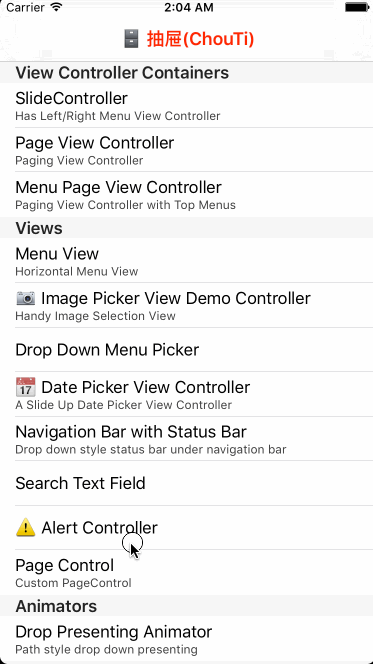

# 🗄 ChouTi

Chou Ti (抽屉) - a Framework for iOS development.

### Core
#### UI
#### Protocols
#### Extensions
#### Data Structures
#### Miscellaneous
#### CodeSnippets

### UI

Name | Preview
:---: | :---:
`PageControl` | 
